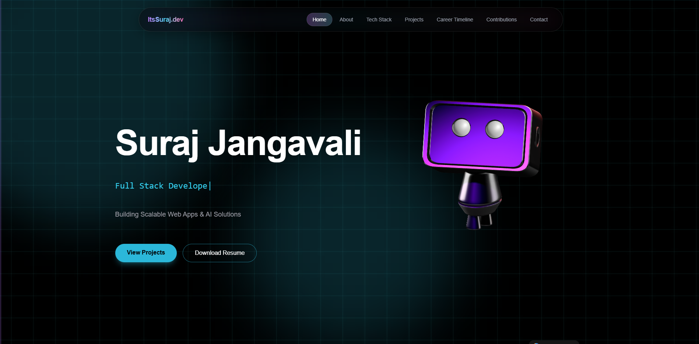
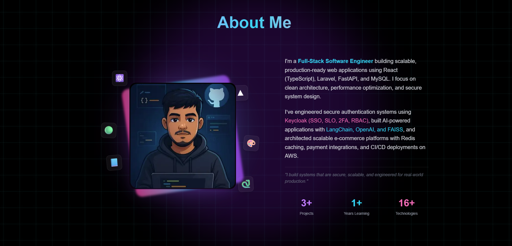

# Next 3D Developer Portfolio

A modern, highly interactive, and performance-optimized 3D developer portfolio built with Next.js, Framer Motion, and Tailwind CSS. Featuring a cyberpunk-inspired aesthetic, smooth scroll parallax animations, and embedded interactive 3D elements.

Built by **Suraj Jangavali** — Full-Stack Software Engineer.




## 🚀 Features

- **Cyberpunk Terminal Boot Sequence:** Animated loading screen with typewriter effect and audio.
- **Interactive 3D Elements:** Deep integration with Spline for engaging, scroll-reactive 3D models.
- **Advanced Animations:** Fluid layout transitions, parallax scrolling, and hover effects powered by Framer Motion.
- **Fully Responsive Codebase:** Seamless layout scaling from mobile to 4k desktop monitors.
- **Dark/Light Mode Support:** Next-themes integration built-in.
- **Optimized Performance:** Dynamic component loading (lazy imports), Next.js compiler optimizations, and minimal CSS stacking contexts.

## 🛠 Tech Stack

- **Framework:** [Next.js 16](https://nextjs.org/) (App Router)
- **Library:** [React 19](https://react.dev/)
- **Styling:** [Tailwind CSS v4](https://tailwindcss.com/)
- **Animations:** [Framer Motion](https://www.framer.com/motion/)
- **3D Engine:** [@splinetool/react-spline](https://spline.design/)
- **Language:** TypeScript

## 💻 Getting Started

### Prerequisites
Make sure you have Node.js (v18.x or later) installed on your machine.

### Installation

1. Clone the repository:
   ```bash
   git clone https://github.com/Suraj80/next-3d-developer-portfolio.git
   ```

2. Navigate to the project directory:
   ```bash
   cd next-3d-developer-portfolio
   ```

3. Install the dependencies:
   ```bash
   npm install
   # or yarn install / pnpm install
   ```

4. Run the development server:
   ```bash
   npm run dev
   ```

5. Open [http://localhost:3000](http://localhost:3000) with your browser to see the result.

## 🎨 Customization

This portfolio is designed to be easily customizable:
- **Personal Details:** Update the content in `src/components/*` (About, Hero, Experience, Projects).
- **Terminal Boot Sequence:** Modify the boot logs in `src/data/terminal.ts`.
- **Navigation:** Adjust sections and links in `src/data/navigation.ts`.
- **3D Models:** Replace the current Spline scene URL in `src/components/SplineRobot.tsx` with your own `.splinecode` export.
- **Resume:** Replace `public/Suraj_Fullstack_Resume.pdf` with your own resume file.

## 📦 Building for Production

To build the application for production, run:

```bash
npm run build
```
This command bundles React in production mode and optimizes the build for the best performance. Once built, you can start the production server with:

```bash
npm run start
```

## 📝 License

This project is entirely open-source. Feel free to use it for your own portfolio, customize it, and deploy it!
